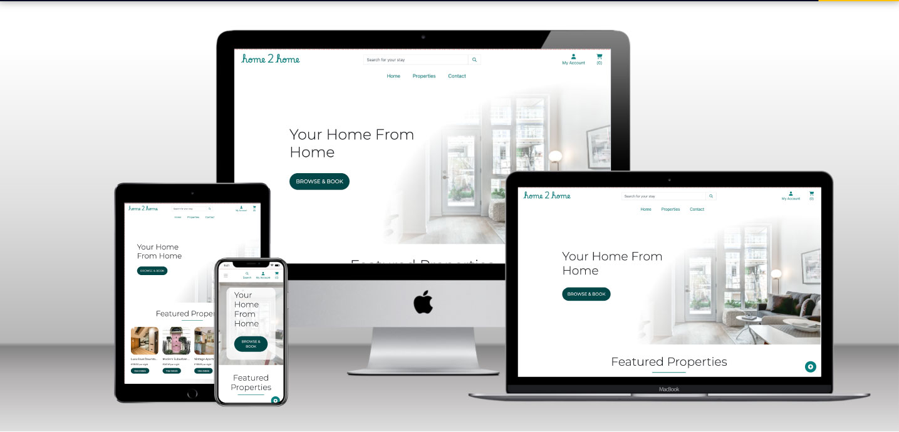
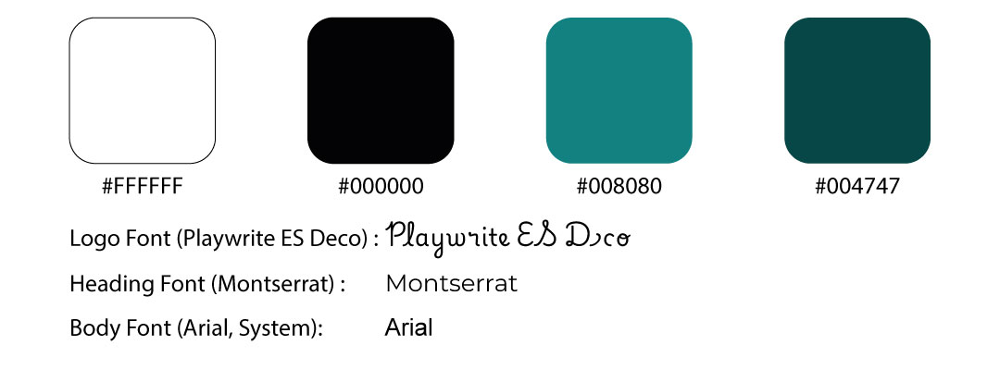
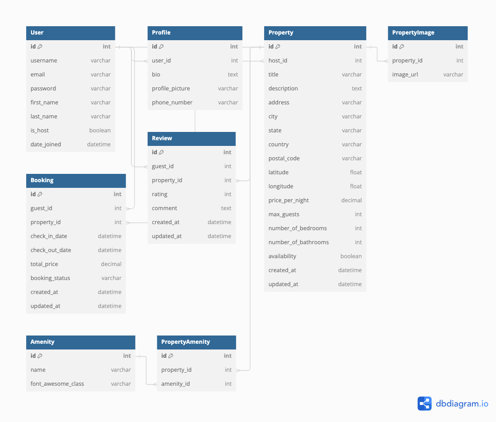

# Home2Home

## Milestone Project 4 - Full Stack Development

<h2 align="center"></h2>

Welcome,

This project is a property rental platform utilizing Django for the backend and HTML, CSS, and JavaScript for the frontend. The platform allows users to register as guests or hosts, list and book properties, and communicate through an integrated messaging system. It also includes Google Maps integration for searching and viewing properties on a map.

* Key features include:
  - Dynamic Filtering : Users can filter properties using a variety of filters for quicker property searching.
  - Active search : Users can search by keyword or phrase to find their ideal property
  - Cart & Stripe Checkout: Users may book one stay per checkout, and proceed to checkout with Stripe. See [Stripe's testing card details](https://stripe.com/docs/testing?testing-method=card-numbers#visa) to place an order on the website.
  - Authentication: Users can create an account to save their contact information and view their bookings (past and future)
  - Reviews: Users can leave reviews only for properties at which they have stayed to ensure verified reviews. 

## Live Project

[View the live project here.](https://home-2-home-534807be7c72.herokuapp.com/)

## Repository

[Find the project repository here.](https://github.com/sdthomas91/home2home)

## Contents
   - [User experience](#user-experience)
      * [User Stories](#user-stories)
         + [Viewing and Navigation](#viewing-and-navigation)
         + [Registration and User Accounts](#registration-and-user-accounts)
         + [Property Listings and Management](#property-listings-and-management)
         + [Booking and Checkout](#booking-and-checkout)
         + [Messaging](#messaging)
         + [Administration and Platform Management](#administration-and-platform-management)
   - [Design](#design)
      + [Colour Scheme](#colour-scheme)
      + [Typography](#typography)
      + [Imagery](#imagery)
      + [Icons](#icons)
      + [Cards](#cards)

# User Experience

## User stories

### Viewing and Navigation
#### Guest

1. I want to be able to view a list of available properties to find one that suits my needs.
2. I want to view individual property details to see the price, description, images, amenities, and reviews.
3. I want to use filters to narrow down property options by location, price range, number of bedrooms, and other criteria.
4. I want to view properties on a map to understand their locations relative to points of interest.
5. I want to easily navigate the site to find and compare properties.

### Registration and User Accounts
#### User

1. I want to easily register for an account to access personalized features.
2. I want to log in and out securely to access my account information.
3. I want to recover my password if I forget it to regain access to my account.
4. I want to receive an email confirmation after registration to verify my account.
5. I want a personalized user profile to view my booking history, manage my listings (if I'm a host), and update my information.

### Property Listings and Management
#### Host

1. I want to add a new property listing to the platform to make it available for booking.
2. I want to edit and update my property listings to keep the information accurate and up to date.
3. I want to upload images for my property listings to attract potential guests.
4. I want to manage the availability of my properties to accurately reflect when they can be booked.
5. I want to delete a property listing if it is no longer available for booking.

### Booking and Checkout
#### Guest

1. I want to easily select check-in and check-out dates to book a property.
2. I want to view the total cost of my booking to avoid any surprises at checkout.
3. I want to enter my payment information securely to complete my booking.
4. I want to receive an order confirmation after booking to verify my reservation details.
5. I want to receive an email confirmation of my booking to keep a record of my reservation.

### Administration and Platform Management
#### Admin

1. I want to manage user accounts to maintain the integrity and safety of the platform.
2. I want to monitor property listings to ensure they comply with platform guidelines.
3. I want to handle booking disputes and issues to provide customer support.
4. I want to manage site content and updates to keep the platform running smoothly.
5. I want to view site analytics to understand user behavior and improve the platform.

# Design

## Colour Scheme
 - The Colour scheme was generally kept simple and in line with best practices, with high WebAim contrast compatibilit as outlined in the [test document](docs/readme/TESTING.md)

### Main Colour
- #008080 - This teal is a revitalizing and rejuvenating color that also represents open communication and clarity of thought.

### Accent Colour
- #004747 - This maintains the teal but darkens the colour to provide user feedback with elements such as hover and active buttons

### Supporting Colours
- #fff & #000 - Used black and white for high contrast, increased accessibility nad user experience. 

## Tyography
- Logo Font : Playwrite ES Deco was used as the main font for the logo/brand of the site. It could not be used for general headings due to readability but for a brand identity it worked nicely as a decorative piece
- Title Font : Montserrat was used as the title font due to high readability, compatability and versatility with differing font weights. 
- Body Font : Body was left as Arial/System font as it pairs well with Montserrat, is universal and highly readable. 

## Imagery
- Little imagery was required for the body of the site due to the population of space with property images. The same image was used for both desktop and mobile hero/body images, though it was scaled accordingly for different viewport sizes. 
- Property images were largely from pexels and all credits will be included in a separate [CREDITS.md](docs/readme/credits.md)

## Icons
- All icons used come from the [FontAwesome library](https://www.fontawesome.com) - they were used to provide information without the need for excess text, though often times they are supported by text for optimum UX. Used across amenities, navbar and search bars.

## Cards
- Used bootstrap cards for visual heirarchy and easy design for properties, profiles and contact forms. These worked especially well for organising content such as property listings when more than one occurs. 

# Wireframes

- Please find all core wireframes [here](docs/readme/wireframes.md)

## Wireframe Deviations
 - There were little to no deviations from the original wireframe. I had a clear idea of how I wanted the User Interface to look and the general navigation of the pages. 
 - One element missed on the wireframe is the location of the filter element on the all properties page. Located below the page title for easy access and maximum UX. 
 - Added "view details" button below properties for easy navigation and kept property cards fairly minimal

# Database Schema

## Diagram 
 - The following image represents the database models and relevant relationships as utilised within the project

 

### DB Models
- A list of database models used in the project can be found below :
   * **User** - stores user information including username, email, password, first name, last name, whether the user is a host, and the date they joined.
   * **Profile** - stores additional information about the user such as bio, profile picture, and phone number. Relates to the User model.
   * **Property** - stores information for each property including host ID, title, description, address, city, state, country, postal code, latitude, longitude, price per night, maximum guests, number of bedrooms, number of bathrooms, availability, creation date, and update date.
   * **PropertyImage** - stores multiple images for each property. Relates to the Property model.
   * **Booking** - stores booking information including guest ID, property ID, check-in date, check-out date, total price, booking status, creation date, and update date. Relates to the User and Property models.
   * **Review** - stores rating and review information including guest ID, property ID, rating, comment, creation date, and update date. Relates to the User and Property models.
   * **Amenity** - stores information about property amenities including the name and font awesome class for the amenity icon.
   * **PropertyAmenity** - stores the relationship between properties and amenities. Relates to the Property and Amenity models.

