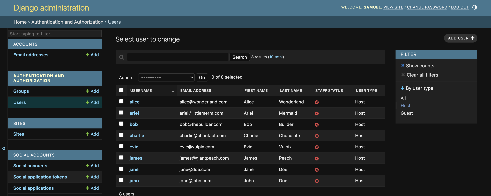

# Bugs

## Users

 - Could not get signup form to display custom field to select user or host
    * Added profile_setup to views but still threw the same issue
    * identified incorrect path being used thanks to DEBUG - accounts/signup.html instead of "account"
    * corrected and form displayed with additional field

 - Cirspy Forms issues
    * could not get crispy forms to load to the system correctly - installed using pip
    * added to installed apps already, hadn't loaded correctly in signup.html 
    * still had issues - added CRISPY_TEMPLATE_PACK = Boostrap4 to settings and installed crispy_bootstrap4 using pip
    * not working still, realised I hadn't added crispy_bootstrap4 to installed apps
    * correct installed apps and now functioning correctly

- Profile viewing 
    * could not get profile page to load 
    * amended urls in project level urls.py (changed '' to 'users/') but this caused more errors
    * changed back to ('') and confirmed views were setup correctly - was missing the view for the profile page
    * updated views and urls and now loads correctly - good to add editing capabilities

- Profile editing 
    * Tried having a profile page that was editable, however it made for a clumsy look so will have a profile page and and edit profile page separate
    * edit page was showing the location of the current profile pic, which I didn't like - tried using Django widgets to get around this but kept getting bootstrap errors as I hid the checkbox for clear. 
    * Decided to leave it on for functionality but it will be a future feature

- Admin View
    * Wanted a way to distinguish between guests and hosts in the admin view
    * Constructed custom admin.py but had issues loading the page - followed [django documentation](https://docs.djangoproject.com/en/5.0/ref/contrib/admin/filters/) to implement the filter view. Functions as hoped
    

- Reviews
    * Used [Simple is better than complex blog](https://simpleisbetterthancomplex.com/) to assist with some of the logic in the reviews model such as custom logic for the save function

- Properties
    * Issues migrating the properties/models.py file
        * When migrating forgot I had previously migrated a properties model and so had to run through some overrides.
        * In doing so, I provided a default date/time and mis formatted - used decimal instead of hyphen.
        * Caused many migration issues, tried using methods such as updating the database with the shell, to no avail as the table hadn't been created, data hadn't migrated so couldn't be altered. 
        * Manually amended the migration file in properties/migrations and this did the trick 
    * Issue with uploading properties.JSON - primary key issue
        * remembered I had to start host PK from 3 due to existing users on the system - amended host foreign key reference in the properties JSON.
        * foreign key constraints was not resolved and couldn't use loaddata - reverse engineered by adding property manually, dumping data into a JSON and comparing. After scanning all JSON data again realise there was a typo. Issue was not with hosts foreign key but amenities as had used 18 and there are only 17 pk's for amenities. 
        * amended to 1 instead of 18 and data uploaded 
    * Sorting in property admin not completely acccurate as it is going off host PK (integer) rather than username (alphabetical)
        * amended admin.py for properties to include custom sorting and ordering - now functions okay
    * Struggling with filtering form displaying well across all screens - got the JS working and the hide and display was perfect. However, when opened the filter options were all over the place
        * tried replacing amenities with a dropdown list, but the form itself wouldn't conform to screen width, and was cluttering the html with bootstrap classes
        * used the col method and was okay for the most part but still looked clumsy
        * changed plan and decided to go with Bootstrap modal for the filtering options, inspired by AirBnb interface. It is clean, easy to use and works responsively. 
    * Amenities ordering - wanted most popular amenities to be listed at the top - should have consideredd this when loading JSON data. Used django documentation and stack overflow to implement manual ordering within the admin interface. This worked nicely and now 8 top amenities show with a "show more" button

- Users
    * Profiles
        - difficulty choosing how to properly setup, as I wanted separate profiles for hosts and guests
        - Went with separation at signup stage by having a signup selection field - override standard allauth signup form
        - Couldn't get my form to load, realised I hadn't provided custom URL to override the allauth redirect
    * Profile setup
        - Had issues separating profile setup - couldn't get separate forms to load depending on host or guest
        - Realised I was overcomplicating the process. Decided to amalgamate the two and have one profile setup form. No fields were explicitly for host or guest anyway. 
    * Profile edit
        - Submitting profile edit worked to an extent but it would not update the name on the profile when you submitted first and last name
        - Identified the issue was with the user model - I had not added or migrated the first name and last name to the user model so there was nothing to update
        - Still not displaying - realised I also needed to update the django templating in the HTML as it was trying to pull a full name, but that isn't a specific field. Changed to first and last and works okay now
    
- Bookings
    * Booking form
        - Issues incorporating the booking form on the property_detail page - throwing a url error 
        - Had added booking URL's but not added to main URL's - easy fix
        - New issue thrown "Cannot assign "<Profile: mrHost>": "Booking.user" must be a "User" instance."
        - Fixed by amending view to include user instead of profile - another easy fix but generated a type error to address which was fixed by updating the booking model
        - Final issue was an operational one as I hadn't migrated the updated booking model - resolved and now need to proceed with checkout and basket to be able to fully test
        
- Basket
    * Adding to basket
        - Tried adding items to basket, had a few minor issues such as redirects to checkout (not created yet) but nothing major. 
        - Line items were missing values so could not generate a total value for the basket. Added in the fields and refreshed but kept populating with £0.00 
        - Tried a number of things including rebuilding the views and forms and reformatting template, but nothing was working.
        - Foolish mistake, existing bookings in the cart were created before model was updated and so had no values for total price etc. 
        - Created new booking and now displays correctly - need to add delete functionality to remove line items or clear basket

