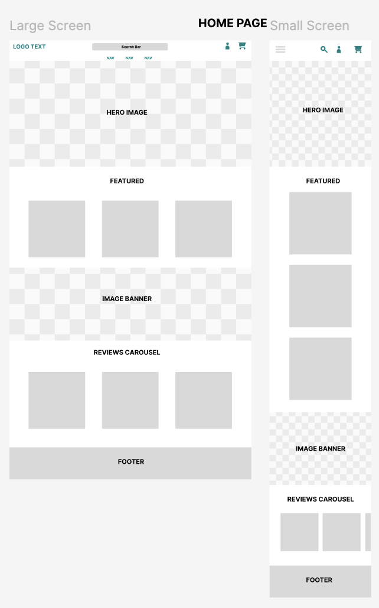
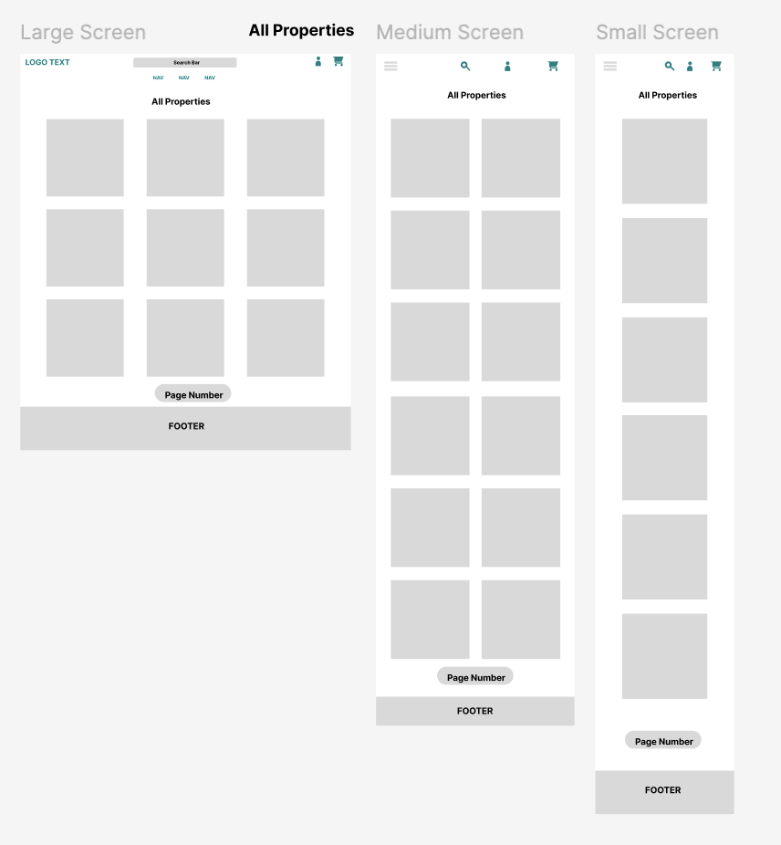
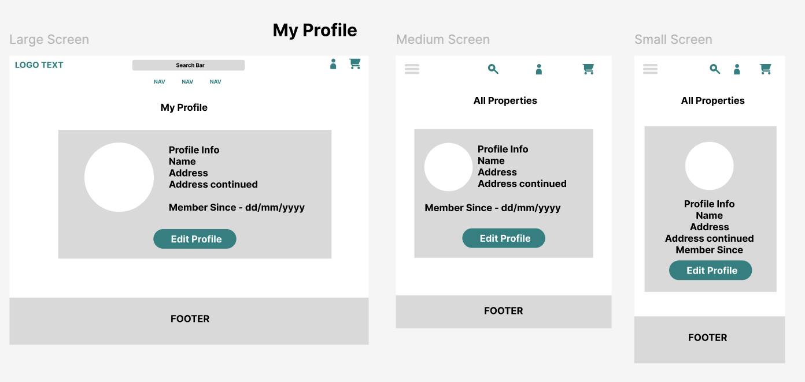

# Wireframes

## Core Wireframes

- I have included below the key wireframes for the foundation of the site. This consists of:
 * The Home Page
 * The Properties Page
 * The Profile Page

### Home Page

- The Home page will consist of several CTA buttons allowing users to view all properties as well as building site trust with reviews and images of featueed properties.

### Properties Page

- The all properties page will allow for user browsing including dynamic filtering for a more personalised booking experience as well as an easy to navigate grid layout. 

### Profile Page

- The profile page will display the logged in users information and allow for editing of the information. In the future I would like to enable a security section allowing for editing of payment information as well as password and email change